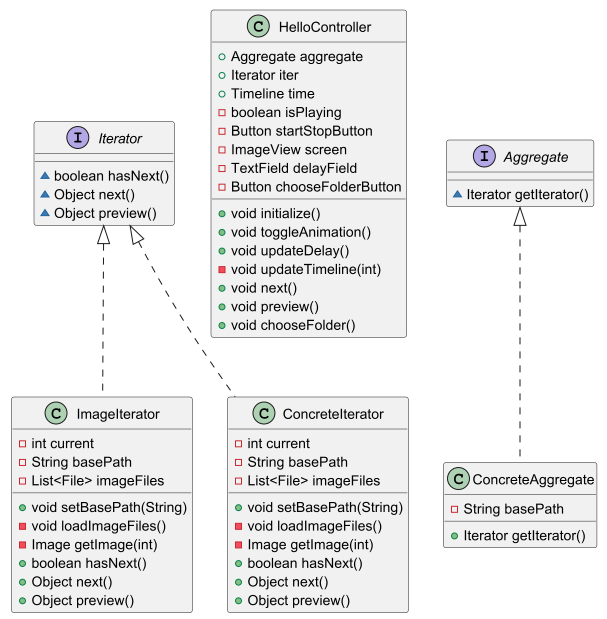

# Проект [Task-4]: Итератор

## Описание

Это приложение предназначено для просмотра изображений в виде слайд-шоу. 
Изображения могут храниться в указанной папке, которая может содержать
вложенные папки. Приложение позволяет перебирать содержимое папок с 
учетом вложенности. Демостраци происходит как вручную, так и с помощью 
динамического задания времени задержки слайдов.


## Требования

- Java 11 или выше
- JavaFX SDK

## Установка и запуск

1. Клонирование репозитория:
   ```bash
   git clone https://github.com/CNNOM/LT-4.git
   
## Структура проекта
- src/main/java/com/example/task1/ - Основные Java-классы проекта.
- HelloApplication.java-  Точка входа в JavaFX-приложение.
- HelloController.java - Контроллер для управления графическим интерфейсом приложения.
- Aggregate - Интерфейс, определяющий метод для получения итератора.
- ConcreteAggregate - Реализация интерфейса Aggregate.
- ConcreteIterator - Реализация интерфейса Iterator.
- ImageIterator - Класс, реализующий интерфейс Iterator для работы с изображениями.
- Iterator -  Интерфейс, определяющий методы для итерации по элементам.


## Функциональность приложения
1) Выбор папки с изображениями
   - Пользователь нажимает кнопку "Выбрать папку" и программа открывает диалоговое окно для выбора папки с изображениями.
2) Просмотр изображений
   - Пользователь может нажать кнопку "Следующее изображение" для просмотра следующего изображения в папке.
   - Пользователь может нажать кнопку "Предыдущее изображение" для просмотра предыдущего изображения в папке.
3) Управление анимацией
   - Пользователь может нажать кнопку "Старт/Стоп" для запуска или остановки автоматической смены изображений.
   - Пользователь может ввести задержку между кадрами в текстовое поле и нажать кнопку "Задать задержку" для изменения скорости анимации.
4) Отображение текущего изображения

## Архитектура
